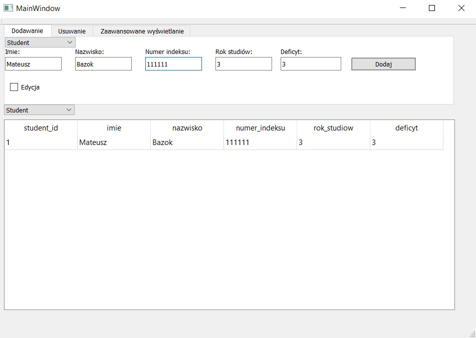

Aplikacja symulująca działanie dziekanatu stworzona przy użyciu Qt, wykorzystująca SQLite.  
Niekótre możliwości aplikacji:  
- dodawanie studentów, prowadzących
- usuwanie prowadzących, sal
- wyświetlanie studentów przypisanych do kursu (przedmiotu)  
- edycja już dodanych elementów
  
Zdjęcia pokazujące działanie aplikacji  

