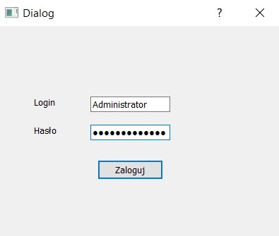
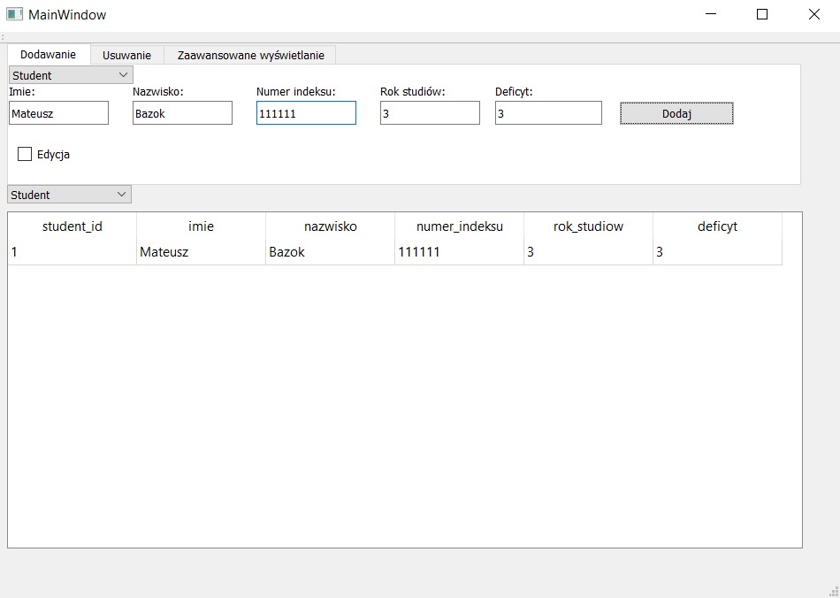

Aplikacja symulująca działanie dziekanatu stworzona przy użyciu Qt, wykorzystująca SQLite.  
Niekótre możliwości aplikacji:  
- Dodawanie studentów, prowadzących
- Usuwanie prowadzących, sal
- Wyświetlanie studentów przypisanych do kursu (przedmiotu)   
  
Zdjęcia pokazujące działanie aplikacji  

